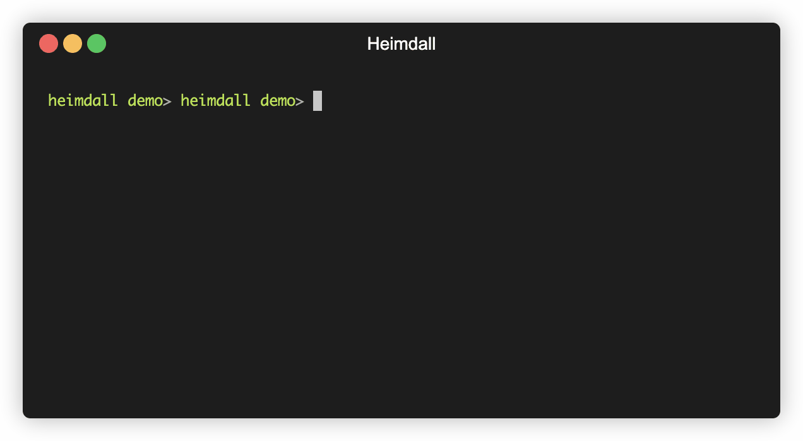

# Welcome to Heimdall

A CLI to help with your git directories (for now 😉).

Based on the myth of the Nordic God, [Heimdall](https://en.wikipedia.org/wiki/Heimdall), the CLI is here to ease with your multiple Git repositories.

A quick demo of the interactive mode.



## How to install

__*On MacOS:*__

Heimdall is available through `brew`

```bash
brew tap yodamad/tools
brew install heimdall
```

__*On Linux:*__ ⚠️ Use it at your own risk *for now* ⚠️

There are available on [Release page](https://github.com/yodamad/heimdall/releases) but not well tested to be honest

__*On Windows:*__ ❌ Not available for now, some compatibilities problems.
