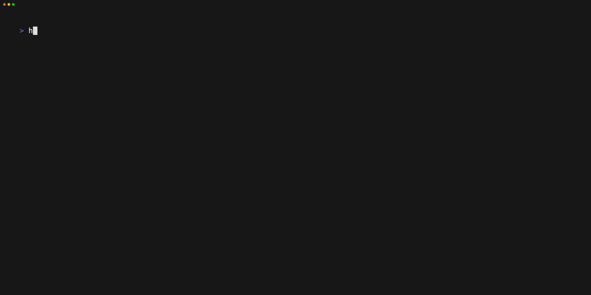

# TUI : `heimdall` or `tui`

Running `heimdall` without any command (or `heimdall tui`, `heimdall ui`) opens a full screen interface to navigate through your git repositories, see their state and run actions on one or several of them.

```bash
heimdall -w ~/work
```



The list shows the repositories found in the [work directory](flags.md#work-directory----work-dir-or--w) as the tree of the folders they are in, like a file navigator : each folder lists its folders, then its repositories, the ones needing attention first. A folder holding nothing but another folder shares its line with it. Next to it are the details of the current repository : what state it is in and what you can do about it, the output of the last commands run on it, its changed files, its incoming and not pushed commits, its branches and its last commits.

On a terminal less than 80 columns wide, the list and the details are displayed one at a time : ++tab++ goes from one to the other.

## Reading the list

Above the list, the header tells how many repositories are in each state, and the colored band below it shows the share of each of them, the most urgent on the left. On the right is the directory Heimdall is looking in or, while actions are running, how many of them are done.

Each repository is listed with the branch it is on, when there is room for it, and its state.

The state of each repository is written in plain words on its right, in a color telling how urgent it is.

| Color | State |
|---|---|
| Red | Diverged from origin, or the repository can't be read |
| Orange | Behind origin |
| Yellow | Local changes |
| Teal | Commits not pushed |
| Green | Up to date |
| Grey | Nothing to do, but it can't be told to be up to date : no remote, branch not on origin, or last fetch more than a day old |

While an action is running on a repository, its state is replaced by what is being done. Then the result of the action is displayed instead, until the next one.

!!!info "No network at startup"
    To be displayed quickly, the list is built from local information only, so what it knows about origin dates from the last fetch. When this fetch is more than a day old, the details tell its age : press ++f++ to check origin.

The other commands (`git-info`, `git-clone`, `good-morning`, `env-info`) are still available for a non-interactive usage.

## Navigation

| Key | Action |
|---|---|
| ++up++ / ++down++ or ++j++ / ++k++ | Move |
| ++g++ / ++shift+g++ or ++home++ / ++end++ | First / last repository |
| ++page-up++ / ++page-down++ | Previous / next page |
| ++tab++ | Go to the details, ++tab++ again to go back |
| ++enter++ | Collapse / expand the folder |
| ++left++ or ++h++ | Collapse the folder, or go to the folder the line is in |
| ++right++ or ++l++ | Expand the folder, or go into it |
| ++z++ | Collapse / expand all the folders |
| ++slash++ | Filter repositories by path |
| ++esc++ | Clear the filter, then the selection |
| ++question++ | Help |
| ++q++ | Quit |

## Selection

Actions are run on the selected repositories or, if none is selected, on the current one. With the cursor on a folder, they are run on all its repositories, the ones of the folders it holds included.

A collapsed folder tells what its repositories need, and the details list them all by state, the ones needing attention first. When the list is scrolled, its first line tells the whole path of the folder the next ones are in.

| Key | Action |
|---|---|
| ++space++ | Select / unselect the current repository, or all the ones of the current folder |
| ++a++ | Select / unselect all the displayed repositories |
| ++u++ | Select the repositories which can be pulled |

## Actions

A confirmation is asked before pulling or running commands on several repositories.

| Key | Action |
|---|---|
| ++r++ | Refresh local status |
| ++f++ | `git fetch` |
| ++p++ | `git pull`, skipped for repositories with local changes |
| ++m++ | Run the morning routine defined in the [configuration file](config.md) |
| ++exclam++ | Run a command |

## Branches

When a repository has several local branches, the details list them : the one the repository is on first, marked with a star, then the most recently committed ones. Each tells where it stands compared to origin and how old its last commit is, so that work left on a branch which was never pushed is not forgotten.

Press ++tab++ to go to the details, then :

| Key | Action |
|---|---|
| ++up++ / ++down++ or ++j++ / ++k++ | Choose a branch, or scroll the details when there is only one |
| ++enter++ | Switch to the chosen branch with `git switch` |
| ++page-up++ / ++page-down++ | Scroll the details |
| ++tab++ or ++esc++ | Go back to the list |

When git refuses to switch, because of local changes for instance, the details tell why.

## Available options

### Search depth: `--depth` or `-d`

By default, it searches no more than 3 levels of subdirectories, you can override this with the `-d` flag of the `tui` command.

```bash
heimdall tui -d 5
```

### Global flags

The [global flags](flags.md) are available too. With `--no-color`, the states are told by their text only and the colored band is not displayed.
